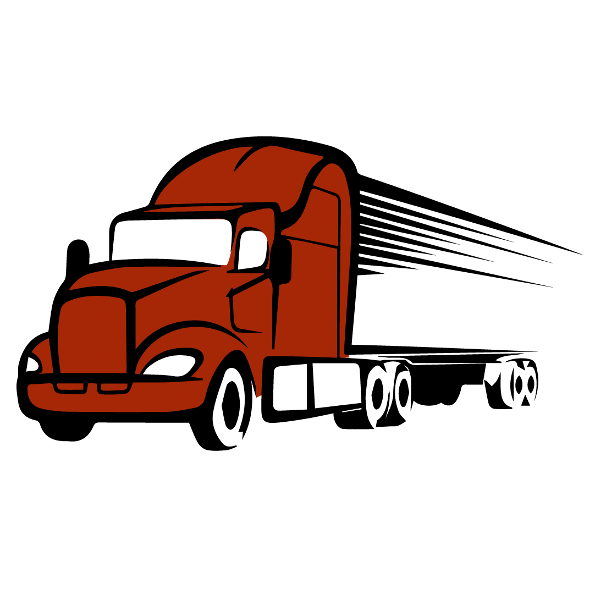

[![Contributors][contributors-shield]][contributors-url]
[![Forks][forks-shield]][forks-url]
[![Stargazers][stars-shield]][stars-url]
[![Issues][issues-shield]][issues-url]
[![MIT License][license-shield]][license-url]
[![LinkedIn][linkedin-shield]][linkedin-url]


<br />
<p align="center">
  <a href="https://github.com/hellmrf/voce-na-estrada-server">
    
  </a>

  <h3 align="center">Você na Estrada</h3>

  <p align="center">
    API RESTful do projeto Você na Estrada.
    <br />
    <a href="#api-docs"><strong>Documentação das rotas »</strong></a>
    <br />
    <br />
    <a href="https://voce-na-estrada.herokuapp.com/">Ver online</a>
    ·
    <a href="https://voce-na-estrada.netlify.app">Ver Site</a>
    ·
    <a href="https://github.com/FabioLafayete/Voce_na_Estrada">Ver Aplicativo</a>
  </p>
</p>


<!-- TABLE OF CONTENTS -->
## Índice

* [Sobre o Projeto](#sobre-o-projeto)
  * [Tecnologias Utilizadas](#tecnologias-utilizadas)
* [API Docs](#api-docs)
* [Uso](#uso---desenvolvimento)


<!-- ABOUT THE PROJECT -->
## Sobre o projeto

Este projeto surge do desafio do Hackathon CCR 2020, focado em propor melhorias para a qualidade de vida e saúde dos caminhoneiros. O projeto foi inteiramente desenvolvido pela equipe 26 entre os dias 12/06 - 14/06/2020.

### Tecnologias Utilizadas

Esta API REST foi desenvolvida em Node.js (com algumas dependências importantes listadas abaixo) e serve de base para o [aplicativo mobile](https://github.com/FabioLafayete/Voce_na_Estrada) (desenvolvido em Flutter) e o [website](https://github.com/hellmrf/voce-na-estrada-web) (desenvolvido em React.JS)

* [Node.js](https://nodejs.org/)
* [Express.js](https://expressjs.com/)
* [Knex.js](http://knexjs.org/)

## API Docs

**Importante:** Todas as rotas esperam um header `Authorization`. Entre em contato com o time de desenvolvimento para obter um. Status 401 ou 403 serão retornados em caso de erro nessa autenticação.

### [GET]: `/checkCNPJ/[cnpj]`

Verifica se o CNPJ informado é válido e existe.

**Retorno:**
- 400 (Bad Request), caso os dados não tenham sido enviados;
- 200 (OK) com o seguinte retorno:
```jsonc
{
    "status": true, //true se o CNPJ existe, false caso contrário
    "cnpj": "00000000000000" // o CNPJ enviado ou "invalido", caso a string enviada não tenha formato de CNPJ
}
```

### [GET]: `/establishment`

Lista todos os estabelecimentos.

Esta rota aceita um filtro opcional de acordo com a latitude. Os seguintes parâmetros podem ser enviados na query:
- `latitude` - latitude do ponto desejado
- `longitude` - longitude do ponto desejado
- `radius` - raio em quilômetros para procurar (Opcional. padrão = 5)

**Retorno:**
```jsonc
{
    "status": true, // true se tiver tudo certo
    "message": "", // mensagem de erro se status === false
    "data": [{
        "id": 0,
        "company_name": "",
        "cnpj": "00000000000000",
        "latitude": -0.0000,
        "longitude": 0.0000,
        "email": "",
        "image": "",
        "category": null,
        "parking": false
    }] // array contendo os estabelecimentos encontrados
}
```

### [GET]: `/establishment/[id]`

Lista os dados do estabelecimento pelo id.

**Retorno:**
```jsonc
{
    "status": true, // true se tiver tudo certo
    "message": "", // mensagem de erro se status === false
    "data": {
        "id": 0,
        "company_name": "",
        "cnpj": "00000000000000",
        "latitude": -0.0000,
        "longitude": 0.0000,
        "email": "",
        "image": "",
        "category": null,
        "parking": false
    } // objeto contendo os dados do estabelecimento procurado
}
```

### [POST]: `/establishment`

Cadastra um novo estabelecimento.

**Corpo da requisição:**
```jsonc
{
    "company_name": "Lorem ipsum Ltda.",
    "cnpj": "00000000000000",
    "latitude": -0.0000,
    "longitude": -0.0000,
    "email": "lorem@ipsum.com",
    "password": "P4$$w0Rd",
    "category": "" //opcional
}
```

**Retorno:**
```jsonc
{
    "status": true, //true se tiver tudo certo
    "message": "" //mensagem de erro se status === false
}
```
### [POST]: `/establishment/login`

Autentica um estabelecimento e devolve um token.

**Corpo da requisição:**
```jsonc
{
    "email": "",
    "password": ""
}
```

**Retorno:**
```jsonc
{
    "status": true, // true se tiver tudo certo
    "message": "", // mensagem de erro se status === false
    "token": "", // se status === true
    "id": 0 // se status === true
}
```

### [PATCH]: `/establishment/[id]/image`

Adiciona a imagem de um estabelecimento.

**Corpo da requisição (multipart/form-data):**
```jsonc
{
    "token": "", //token retornado pela rota /establishment/login.
    "email": "",
    "image": "" //Uploaded image.
}
```

**Retorno:**
```jsonc
{
    "status": true, //true se tiver tudo certo
    "message": "" //mensagem de erro se status === false
}
```

### [GET]: `/products/[establishment_id]`

Lista os produtos de um estabelecimento.

**Retorno:**
```jsonc
{
    "status": true, // true se tiver tudo certo
    "message": "", // mensagem de erro se status === false
    "data": [{
        "id": 0,
        "title": "",
        "price": 12.99,
        "cashback": 0.05,
        "image": "",
        "description": ""
    }] // array contendo os produtos encontrados
}
```

# Uso - Desenvolvimento

O ambiente precisa ter instalado o Node.js e o npm, bem como ter acesso a um banco de dados MySQL. Crie uma pasta `database` na raiz do projeto e, dentro dela, um arquivo `database.json` com as configurações do banco de dados, conforme:
```json
{
    "host": "",
    "user": "",
    "password": "",
    "database": "dbhack"
}
```
Então execute:
```sh
# Instala todas as dependências
$ npm i
# Migrações do banco de dados
$ npm run knex:migrate
# Executa o servidor na porta 3001
$ npm start
```

<!-- MARKDOWN LINKS & IMAGES -->
<!-- https://www.markdownguide.org/basic-syntax/#reference-style-links -->
[contributors-shield]: https://img.shields.io/github/contributors/hellmrf/voce-na-estrada-server.svg?style=flat-square
[contributors-url]: https://github.com/hellmrf/voce-na-estrada-server/graphs/contributors
[forks-shield]: https://img.shields.io/github/forks/hellmrf/voce-na-estrada-server.svg?style=flat-square
[forks-url]: https://github.com/hellmrf/voce-na-estrada-server/network/members
[stars-shield]: https://img.shields.io/github/stars/hellmrf/voce-na-estrada-server.svg?style=flat-square
[stars-url]: https://github.com/hellmrf/voce-na-estrada-server/stargazers
[issues-shield]: https://img.shields.io/github/issues/hellmrf/voce-na-estrada-server.svg?style=flat-square
[issues-url]: https://github.com/hellmrf/voce-na-estrada-server/issues
[license-shield]: https://img.shields.io/github/license/hellmrf/voce-na-estrada-server.svg?style=flat-square
[license-url]: https://github.com/hellmrf/voce-na-estrada-server/blob/master/LICENSE.txt
[linkedin-shield]: https://img.shields.io/badge/-LinkedIn-black.svg?style=flat-square&logo=linkedin&colorB=555
[linkedin-url]: https://linkedin.com/in/othneildrew
[product-screenshot]: images/screenshot.png